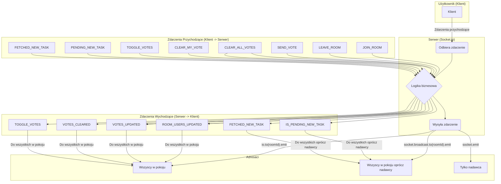

# Dokumentacja Zdarzeń WebSocket

Poniżej znajduje się diagram i opis zdarzeń WebSocket używanych w aplikacji.

## Diagram Przepływu Zdarzeń (Mermaid)

## Opis Zdarzeń i Payloadów

### Zdarzenia Przychodzące (Klient -> Serwer)

| Nazwa Zdarzenia | Payload | Opis |
| :--- | :--- | :--- |
| `JOIN_ROOM` | `{ roomId: string, user: User }` | Dołącza użytkownika do pokoju. |
| `LEAVE_ROOM` | `{ roomId: string }` | Usuwa użytkownika z pokoju. |
| `SEND_VOTE` | `{ roomId: string, vote: string \| number }` | Wysyła głos użytkownika. |
| `CLEAR_ALL_VOTES` | `{ roomId: string }` | Żądanie wyczyszczenia wszystkich głosów w pokoju. |
| `CLEAR_MY_VOTE` | `{ roomId: string }` | Żądanie wyczyszczenia głosu bieżącego użytkownika. |
| `TOGGLE_VOTES` | `{ roomId: string, show: boolean }` | Żądanie pokazania lub ukrycia wyników głosowania. |
| `PENDING_NEW_TASK` | `{ roomId: string }` | Informuje, że nowy task jest w trakcie przygotowania. |
| `FETCHED_NEW_TASK` | `{ roomId: string, task: object }` | Wysyła nowo pobrany task do innych. |

### Zdarzenia Wychodzące (Serwer -> Klient)

| Nazwa Zdarzenia | Payload | Propagacja | Opis |
| :--- | :--- | :--- | :--- |
| `ROOM_USERS_UPDATED` | `Vote[]` | **Do wszystkich w pokoju** | Wysyła zaktualizowaną listę użytkowników i ich głosów. |
| `VOTES_UPDATED` | `Vote[]` | **Do wszystkich w pokoju** | Wysyła zaktualizowaną listę głosów po tym, jak ktoś zagłosował. |
| `VOTES_CLEARED` | `void` | **Do wszystkich w pokoju** | Informuje, że wszystkie głosy zostały wyczyszczone. |
| `TOGGLE_VOTES` | `{ show: boolean }` | **Do wszystkich w pokoju** | Wysyła stan widoczności wyników głosowania. |
| `IS_PENDING_NEW_TASK` | `void` | **Do wszystkich oprócz nadawcy** | Informuje innych użytkowników, że nowy task jest w przygotowaniu. |
| `FETCHED_NEW_TASK` | `object` | **Do wszystkich oprócz nadawcy** | Rozsyła nowo pobrany task do pozostałych użytkowników w pokoju. |

### Typy Danych

*   **`User`**: `{ dbId: string, role: string, name: string, email: string }`
*   **`Vote`**: `{ userId: string, user: User, value: string | number | null }`
